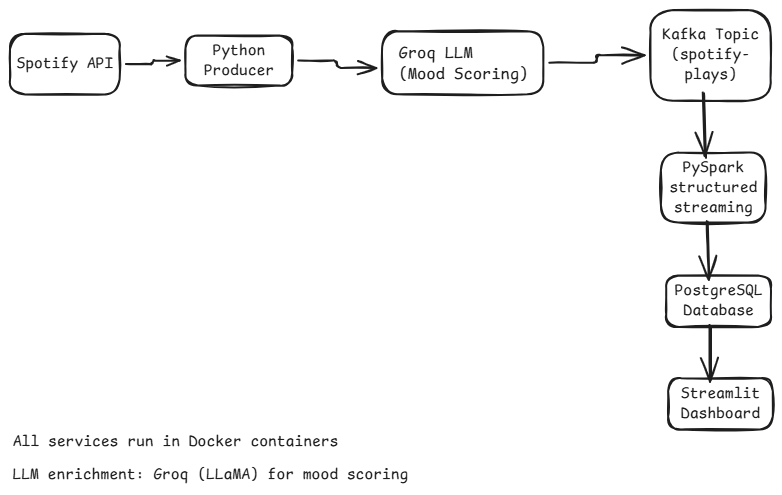
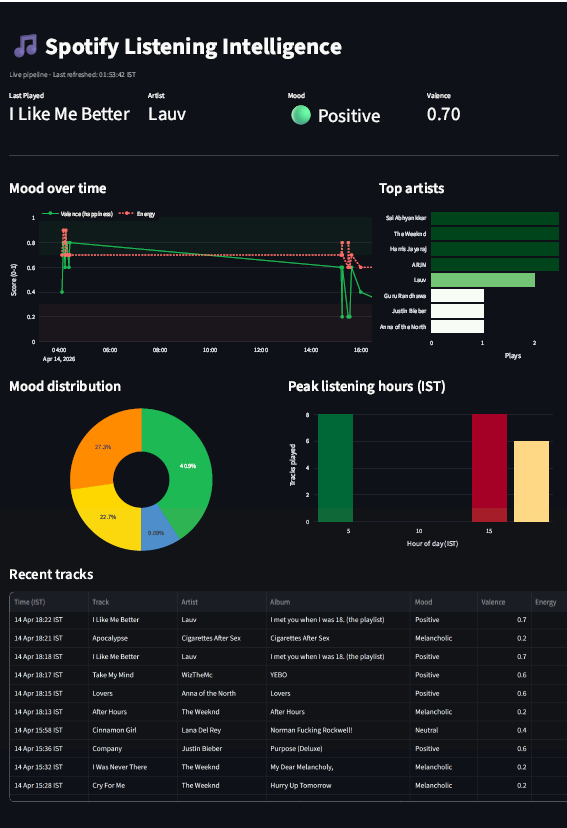

# Spotify Listening Intelligence Pipeline

A real-time data pipeline that ingests personal Spotify listening data, enriches each track with AI-generated mood scores, and serves live analytics on a Streamlit dashboard.

## Architecture



```
Spotify API → Python Producer → Groq LLM (Mood Scoring) → Kafka → PySpark Streaming → PostgreSQL → Streamlit
```

## Dashboard




## What it does

- Polls Spotify API every 30 seconds for currently playing / recently played tracks
- Enriches each track with mood scores (valence, energy, danceability, tempo) using Groq's LLaMA model
- Streams events through Kafka for decoupled, fault-tolerant ingestion
- Processes events in PySpark Structured Streaming with session detection and mood labelling
- Stores processed data in PostgreSQL
- Serves a live Streamlit dashboard with mood curves, top artists, peak listening hours, and recent tracks

## Tech Stack

| Component | Technology |
|---|---|
| Ingestion | Python, Spotipy, Kafka Producer |
| Message Queue | Apache Kafka |
| Stream Processing | PySpark Structured Streaming |
| LLM Enrichment | Groq API (LLaMA 3.3 70B) |
| Storage | PostgreSQL 15 |
| Dashboard | Streamlit, Plotly |
| Infrastructure | Docker, Docker Compose |

## Key Engineering Decisions

**Why Kafka over a direct database write?**
Kafka decouples the producer and consumer. If the Spark job goes down, events accumulate in Kafka and are replayed when it restarts — no data loss. Kafka also persists messages for 7 days, acting as an audit log of all listening events.

**Why PySpark Structured Streaming over plain Python?**
Session detection requires stateful computation across events — knowing the gap between the current track and the previous one. Spark handles state, windowing, and fault tolerance via checkpointing out of the box. Plain Python would require fragile custom state management.

**Why Groq for mood estimation?**
Spotify deprecated their audio features API for new developer apps in late 2024. I replaced it with LLM-based mood estimation — sending track name and artist to LLaMA 3.3 and getting back valence, energy, danceability, and tempo as structured JSON. This is a real-world pattern: using AI enrichment when an upstream data source changes or disappears.

**Why Docker?**
A single `docker-compose up` starts all services — Kafka, Zookeeper, PostgreSQL, and the Spark consumer. Reproducible across any machine with no manual installation of Java, Kafka, or PostgreSQL.

**Why two Kafka listener addresses?**
The Python producer runs on Windows and connects via `localhost:9092`. The Spark consumer runs inside Docker and connects via `kafka:29092` on the internal Docker network. Two listeners allow both to connect to the same Kafka broker without conflict.

## Project Structure

```
spotify-pipeline/
├── producer/
│   └── spotify_producer.py      # Spotify API polling + Groq enrichment + Kafka publisher
├── consumer/
│   └── spark_consumer.py        # PySpark Structured Streaming consumer
├── dashboard/
│   └── app.py                   # Streamlit live dashboard
├── docker-compose.yml           # All infrastructure services
├── postgresql-42.7.3.jar        # JDBC driver for Spark-PostgreSQL connection
├── requirements.txt
├── architecture.png
├── dashboard_screenshot.png
└── .env                         # API keys (never committed)
```

## How to Run

### Prerequisites
- Docker Desktop
- Python 3.10+
- Spotify Developer account ([developer.spotify.com](https://developer.spotify.com))
- Groq API key (free at [console.groq.com](https://console.groq.com))

### Setup

**1. Clone the repo**
```bash
git clone https://github.com/jayaharini704/spotify-pipeline.git
cd spotify-pipeline
```

**2. Create virtual environment**
```bash
python -m venv venv
venv\Scripts\activate
pip install -r requirements.txt
```

**3. Create `.env` file**
```
SPOTIFY_CLIENT_ID=your_client_id
SPOTIFY_CLIENT_SECRET=your_client_secret
SPOTIFY_REDIRECT_URI=http://127.0.0.1:8888/callback
GROQ_API_KEY=your_groq_key
POSTGRES_HOST=127.0.0.1
POSTGRES_PORT=5433
POSTGRES_DB=spotify_db
POSTGRES_USER=spotify_user
POSTGRES_PASS=spotify_pass
```

**4. Start all Docker services**
```bash
docker-compose up -d
```

**5. Create the database table**
```bash
docker exec -it postgres psql -U spotify_user -d spotify_db -c "
CREATE TABLE IF NOT EXISTS tracks (
    id SERIAL PRIMARY KEY,
    track_id VARCHAR(100),
    track_name VARCHAR(500),
    artist VARCHAR(500),
    album VARCHAR(500),
    duration_ms INTEGER,
    played_at TIMESTAMP,
    source VARCHAR(50),
    valence FLOAT,
    energy FLOAT,
    danceability FLOAT,
    tempo FLOAT,
    session_id VARCHAR(100),
    mood_label VARCHAR(50)
);"
```

**6. Start the producer**
```bash
python producer/spotify_producer.py
```
On first run, a browser window opens to authenticate with your Spotify account. After that, authentication is cached automatically.

**7. Run the dashboard**
```bash
streamlit run dashboard/app.py
```

Open [http://localhost:8501](http://localhost:8501) in your browser.

## How the Pipeline Works

```
Every 30 seconds:
1. Producer polls Spotify API → gets currently playing / recently played track
2. Sends track name + artist to Groq LLaMA → gets valence, energy, danceability, tempo
3. Publishes enriched event to Kafka topic: spotify-plays
4. Spark consumer reads from Kafka in 30-second micro-batches
5. Detects session boundaries (gap > 30 min = new session)
6. Assigns mood labels based on valence score
7. Writes processed records to PostgreSQL
8. Streamlit dashboard queries PostgreSQL and auto-refreshes every 30 seconds
```

## Mood Labels

| Valence Score | Mood Label |
|---|---|
| > 0.7 | Happy |
| > 0.5 | Positive |
| > 0.3 | Neutral |
| > 0.1 | Melancholic |
| ≤ 0.1 | Sad |

## What I Learned

- Building a production-style real-time streaming pipeline with Kafka and PySpark on Windows
- Handling upstream API deprecations gracefully with LLM-based enrichment fallbacks
- Docker networking — internal vs external Kafka listeners for containers vs host machine
- Fault tolerance with Spark checkpointing and Kafka message persistence
- Stateful stream processing for session detection using window functions and lag
- Debugging distributed systems across multiple Docker containers